# Отчёт по лабораторной работе №6

**Вариант:** 486081

---

## 1. Текст задания

Разделить программу из лабораторной работы №5 на клиентский и серверный модули. Серверный модуль должен осуществлять выполнение команд по управлению коллекцией. Клиентский модуль должен в интерактивном режиме считывать команды, передавать их для выполнения на сервер и выводить результаты выполнения.

### Требования к реализации:
1. Операции обработки объектов коллекции должны быть реализованы с помощью Stream API с использованием лямбда-выражений.
2. Объекты между клиентом и сервером должны передаваться в сериализованном виде.
3. Объекты в коллекции, передаваемой клиенту, должны быть отсортированы по местоположению.
4. Клиент должен корректно обрабатывать временную недоступность сервера.
5. Обмен данными между клиентом и сервером должен осуществляться по протоколу UDP.
6. Для обмена данными на сервере необходимо использовать датаграммы (`DatagramSocket`/`DatagramPacket`).
7. Для обмена данными на клиенте необходимо использовать сетевой канал (`DatagramChannel`).
8. Сетевые каналы должны использоваться в неблокирующем режиме (`configureBlocking(false)`).
9. Дополнительно: реализовать логирование работы сервера с помощью Logback.

---

## 2. Диаграмма классов разработанной программы

Ниже представлена Mermaid-диаграмма классов, показывающая разделение на модули `common`, `server` и `client` и их связи.

```mermaid
classDiagram
    %% Module: Common
    namespace common_model {
        class Worker {
            -long id
            -String name
            -Coordinates coordinates
            -Date creationDate
            -Integer salary
            -Position position
            -Status status
            -Organization organization
            +compareTo(Worker other) int
        }
        class Coordinates {
            -Integer x
            -Double y
            +compareTo(Coordinates other) int
        }
        class Organization {
            -Integer employeesCount
            -OrganizationType type
        }
    }
    
    namespace common_interaction {
        class Request {
            -String commandName
            -String commandStringArgument
            -Serializable commandObjectArgument
            +getCommandName() String
            +getCommandStringArgument() String
            +getCommandObjectArgument() Serializable
        }
        class Response {
            -ResponseCode responseCode
            -String responseBody
            +getResponseCode() ResponseCode
            +getResponseBody() String
        }
        class ResponseCode {
            <<enumeration>>
            OK
            ERROR
            SERVER_EXIT
        }
    }
    
    %% Module: Client
    namespace client {
        class ClientApp {
            +main(String[] args)
        }
        class UDPClient {
            -InetSocketAddress serverAddress
            -DatagramChannel channel
            +start() void
            +sendAndReceive(Request request) Response
            -serialize(Object obj) byte[]
            -deserialize(byte[] bytes) Response
        }
        class WorkerReader {
            -ConsoleInputManager inputManager
            -ScriptReader scriptReader
            +readWorker() Worker
            +readCoordinates() Coordinates
            +readOrganization() Organization
        }
        class ConsoleInputManager {
            -Scanner scanner
            +readLine(String msg) String
        }
        class ScriptReader {
            -Stack scanners
            -Stack fileNames
            +pushFile(String fileName) void
            +readLine() String
        }
    }
    
    %% Module: Server
    namespace server {
        class ServerApp {
            +main(String[] args)
        }
        class UDPServer {
            -int port
            -WorkerManager workerManager
            -DatagramSocket socket
            +start() void
            +stop() void
            -handleRequest(Request req) Response
            -sendResponse(Response res, DatagramPacket pkt) void
        }
        class WorkerManager {
            -PriorityQueue collection
            -FileManager fileManager
            +info() String
            +show() String
            +add(Worker w) String
            +update(long id, Worker w) String
            +removeById(long id) String
            +clear() String
            +save() void
        }
        class FileManager {
            -String fileName
            +saveCollection(Collection c) void
            +readCollection() PriorityQueue
        }
        class IdManager {
            -long nextId
            -Set usedIds
            +generateId() long
            +useId(long id) void
        }
    }

    %% Relationships
    Worker --> Coordinates
    Worker --> Organization
    UDPClient ..> Request : sends
    UDPClient ..> Response : receives
    UDPServer ..> Request : receives
    UDPServer ..> Response : sends
    WorkerReader ..> Worker : creates
    WorkerManager --> Worker : manages
    WorkerManager --> FileManager : uses
    ServerApp --> WorkerManager : initializes
    ServerApp --> UDPServer : runs
    ClientApp --> UDPClient : uses
    ClientApp --> WorkerReader : uses
```

---

## 3. Подробная теория к защите лабораторной работы

### Вопрос 1. Сетевое взаимодействие — клиент-серверная архитектура, основные протоколы, их сходства и отличия.
**Клиент-серверная архитектура** — это паттерн проектирования программного обеспечения, в котором задачи распределяются между поставщиками услуг (серверами) и их заказчиками (клиентами). Клиент отправляет запрос, а сервер его обрабатывает и возвращает ответ.

#### Основные протоколы транспортного уровня:
1. **TCP (Transmission Control Protocol)** — протокол гарантированной доставки с установлением соединения.
2. **UDP (User Datagram Protocol)** — протокол быстрой доставки пакетов (датаграмм) без установления соединения.

| Характеристика | TCP | UDP |
|---|---|---|
| **Соединение** | Требуется предварительное установление связи ("трехэтапное рукопожатие"). | Установление связи не требуется. Данные отправляются сразу. |
| **Надежность** | Гарантированная доставка (подтверждение приема, повторная отправка при потере пакетов). | Негарантированная доставка (пакеты могут потеряться, продублироваться или прийти в неверном порядке). |
| **Порядок пакетов** | Пакеты собираются строго в порядке их отправки. | Порядок пакетов не гарантируется. |
| **Скорость** | Более медленный (из-за накладных расходов на контроль целостности и порядка). | Высокая скорость и минимальные накладные расходы. |
| **Формат данных** | Поток байт (Stream). | Отдельные пакеты (Датаграммы). |

---

### Вопрос 2. Протокол TCP. Классы Socket и ServerSocket в Java.
В Java работа с TCP реализована с помощью блокирующего ввода-вывода в пакете `java.net`.

- **`ServerSocket`** — используется на стороне сервера для прослушивания определенного порта и ожидания входящих подключений от клиентов. Метод `accept()` блокирует вызывающий поток до тех пор, пока клиент не подключится. При успешном подключении он возвращает объект `Socket` для взаимодействия с этим клиентом.
- **`Socket`** — представляет собой конечную точку сетевого соединения между клиентом и сервером. Через него можно получать входной (`InputStream`) и выходной (`OutputStream`) потоки для чтения и записи байтов данных.

---

### Вопрос 3. Протокол UDP. Классы DatagramSocket и DatagramPacket в Java.
Поскольку протокол UDP работает без установления соединений, в нем нет понятий "серверный сокет" и "клиентский сокет". Вместо этого используется класс `DatagramSocket`, способный как отправлять, так и принимать пакеты (`DatagramPacket`).

- **`DatagramSocket`** — класс, представляющий сетевой сокет для отправки и получения датаграммных пакетов. Метод `receive(DatagramPacket p)` блокирует поток до тех пор, пока на порт не поступит UDP-пакет.
- **`DatagramPacket`** — класс, представляющий контейнер данных (датаграмму). Содержит:
  - Буфер байтов (полезная нагрузка).
  - Длину передаваемых данных.
  - IP-адрес и порт назначения (при отправке) или отправителя (при приеме).

---

### Вопрос 4. Отличия блокирующего и неблокирующего ввода-вывода, их преимущества и недостатки. Работа с сетевыми каналами.
В Java сетевое взаимодействие разделено на два API:
1. **OIO (Old I/O)** — традиционный блокирующий ввод-вывод (`java.net`).
2. **NIO (New I/O)** — неблокирующий ввод-вывод (`java.nio`).

#### Блокирующий ввод-вывод (Blocking I/O):
- Поток, вызвавший метод `read()` или `accept()`, приостанавливает выполнение (блокируется) до тех пор, пока данные не будут доступны или подключение не установится.
- *Преимущества:* Прост в реализации и понимании, линеен.
- *Недостатки:* Требует выделения отдельного потока на каждое клиентское подключение (модель Thread-per-Client), что плохо масштабируется при тысячах клиентов.

#### Неблокирующий ввод-вывод (Non-blocking I/O):
- Поток выполняет запрос на чтение/запись. Метод мгновенно возвращает управление. Если данных нет, метод возвращает `0` или `null`, но поток не засыпает.
- Сетевые каналы (`SelectableChannel`) могут работать с `Selector` (системным мультиплексором), который позволяет одному потоку контролировать состояние множества каналов (готовность к чтению, записи или подключению).
- *Преимущества:* Высокая масштабируемость, эффективное использование ресурсов ОС.
- *Недостатки:* Сложная архитектура кода (асинхронная обработка, буферизация).

---

### Вопрос 5. Классы SocketChannel и DatagramChannel в Java.
- **`SocketChannel`** — неблокирующий аналог TCP-сокета (`Socket`). Поддерживает асинхронное подключение, чтение из `ByteBuffer` и запись в него.
- **`DatagramChannel`** — неблокирующий аналог UDP-сокета. Позволяет отправлять и принимать датаграммы в неблокирующем режиме через методы `send(ByteBuffer, SocketAddress)` и `receive(ByteBuffer)`.
  - При установке `configureBlocking(false)` метод `receive()` моментально возвращает `null`, если во входящем буфере сетевой карты нет данных.

---

### Вопрос 6. Передача данных по сети. Сериализация объектов.
Передача сложных Java-объектов по сети требует их преобразования в плоскую последовательность байт. Этот процесс называется **сериализацией**. Обратный процесс преобразования последовательности байт в Java-объект в памяти называется **десериализацией**.

В Java стандартным механизмом является использование потоков `ObjectOutputStream` (для сериализации) и `ObjectInputStream` (для десериализации). Сериализуемый класс обязан реализовывать маркерный интерфейс `java.io.Serializable`.

---

### Вопрос 7. Интерфейс Serializable. Объектный граф, сериализация и десериализация полей и методов.
- **Интерфейс `Serializable`** — маркерный интерфейс (не имеет методов). Указывает JVM, что объекты данного класса могут быть записаны в байтовый поток.
- **`serialVersionUID`** — уникальный идентификатор версии сериализованного класса. Защищает от несовместимости классов при изменении структуры полей на клиенте или сервере. Если не объявлен явно, генерируется JVM автоматически на основе структуры класса, но любое мелкое изменение приведет к `InvalidClassException`.
- **Объектный граф (Object Graph)** — сериализатор записывает не только сам объект, но и все объекты, на которые он ссылается (весь граф объектов). Если в графе есть хоть один объект класса, не реализующего `Serializable`, будет выброшено исключение `NotSerializableException`.
- **Ключевое слово `transient`** — используется для исключения полей из процесса сериализации (например, пароли, соединения, временные кэши). При десериализации такие поля получают дефолтные значения (null, 0, false).
- Статические поля (`static`) не сериализуются, так как они принадлежат классу, а не объекту.

---

### Вопрос 8. Java Stream API. Создание конвейеров. Промежуточные и терминальные операции.
**Stream API** — инструмент для обработки коллекций данных в декларативном стиле с использованием лямбда-выражений.

#### Создание стримов (конвейеров):
- Из коллекции: `collection.stream()`
- Из массива: `Arrays.stream(array)`
- Напрямую: `Stream.of(a, b, c)`

#### Промежуточные операции (Intermediate / Lazy):
Возвращают новый Stream, не выполняют реальных вычислений до запуска терминальной операции.
- `filter(Predicate)` — фильтрация по условию.
- `map(Function)` — преобразование элементов в другой тип.
- `sorted(Comparator)` — сортировка элементов.
- `limit(n)`, `skip(n)` — ограничение количества элементов.

#### Терминальные операции (Terminal / Eager):
Запускают обработку данных и закрывают Stream. Возвращают конечный результат или производят Side-effect.
- `forEach(Consumer)` — выполнение действия для каждого элемента.
- `collect(Collector)` — сборка элементов в коллекцию или строку.
- `count()` — подсчет количества элементов.
- `reduce(...)` — агрегация элементов в единый объект.
- `findFirst()`, `findAny()` — поиск элементов (возвращают `Optional`).
- `average()`, `sum()`, `max()`, `min()` — математические операции (для примитивных стримов).

---

### Вопрос 9. Шаблоны проектирования (Design Patterns).
1. **Decorator (Декоратор)** — динамически добавляет объекту новые обязанности. В Java: `BufferedReader reader = new BufferedReader(new InputStreamReader(System.in))`.
2. **Iterator (Итератор)** — предоставляет способ последовательного доступа к элементам коллекции без раскрытия ее внутреннего представления.
3. **Factory Method (Фабричный метод)** — определяет интерфейс для создания объекта, но оставляет подклассам решение о том, какой класс инстанцировать.
4. **Command (Команда)** — инкапсулирует запрос в виде объекта, позволяя параметризовать клиенты различными запросами. Используется для управления командами на сервере.
5. **Flyweight (Приспособленец / Легковес)** — используется для минимизации расхода памяти путем совместного использования общего состояния множеством объектов.
6. **Interpreter (Интерпретатор)** — определяет грамматику и интерпретатор для языка. Используется при разборе выражений.
7. **Singleton (Одиночка)** — гарантирует, что у класса есть только один экземпляр, и предоставляет к нему глобальную точку доступа. (Например, `IdManager` или конфигурации).
8. **Strategy (Стратегия)** — определяет семейство алгоритмов, инкапсулирует каждый из них и делает их взаимозаменяемыми. (Сортировка по разным компараторам).
9. **Adapter (Адаптер)** — преобразует интерфейс одного класса в интерфейс другого, который ожидают клиенты.
10. **Facade (Фасад)** — предоставляет унифицированный интерфейс к группе интерфейсов подсистемы, упрощая работу с ней.
11. **Proxy (Заместитель)** — предоставляет объект-заместитель для контроля доступа к другому объекту.

---

## 4. Исходный код программы

Исходный код программы разделен на три Gradle-модуля. Ключевые компоненты:
- **`common`**: `common.model.Worker`, `common.interaction.Request`, `common.interaction.Response`
- **`server`**: `server.UDPServer`, `server.WorkerManager`, `server.FileManager`, `server.ServerApp`
- **`client`**: `client.UDPClient`, `client.WorkerReader`, `client.ClientApp`

Все файлы реализованы в соответствии с принципами чистого кода, инкапсуляции и обработки исключений.

---

## 5. Выводы по работе

В ходе выполнения лабораторной работы №6 было успешно спроектировано и реализовано клиент-серверное приложение на базе протокола UDP. 

1. **Разделение обязанностей**: Программа разделена на три логических модуля (`common`, `server`, `client`), что улучшает расширяемость и масштабируемость кода.
2. **Асинхронность и неблокирующий ввод-вывод**: На стороне клиента применен неблокирующий `DatagramChannel`, что позволило реализовать отзывчивый интерфейс с таймаутами для обработки временной недоступности сервера.
3. **Сетевой обмен**: Объекты команд (`Request`) и ответов (`Response`) передаются в строго сериализованном виде, исключая передачу "простых строк".
4. **Stream API**: Все операции обработки данных в `WorkerManager` на сервере реализованы с помощью Stream API и лямбда-выражений, включая сортировку по координатам (местоположению) при передаче данных клиенту.
5. **Логирование**: С помощью Logback реализовано детальное логирование этапов работы сервера, включая запуск, прием датаграмм, обработку команд, автосохранение и остановку.
